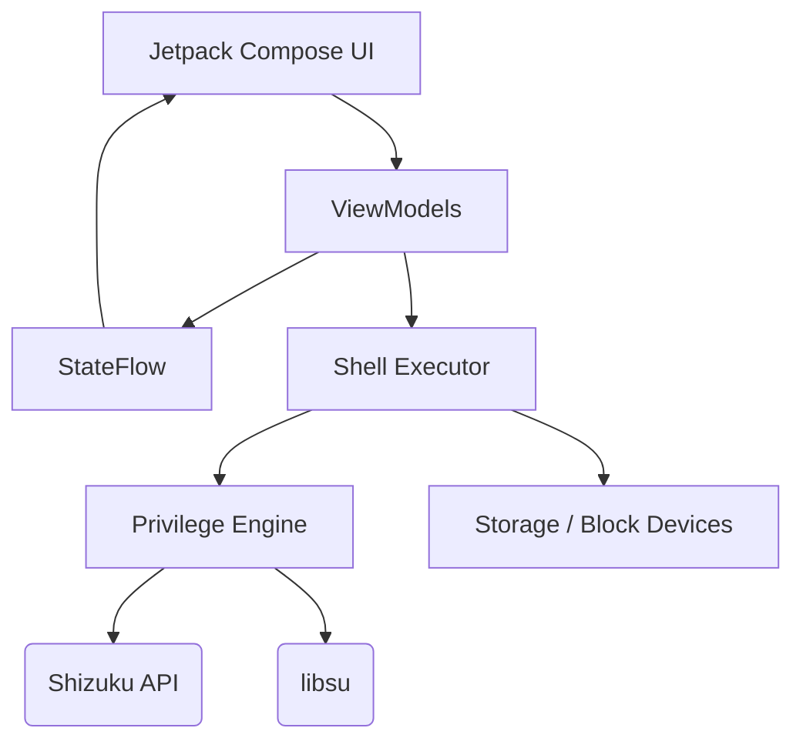
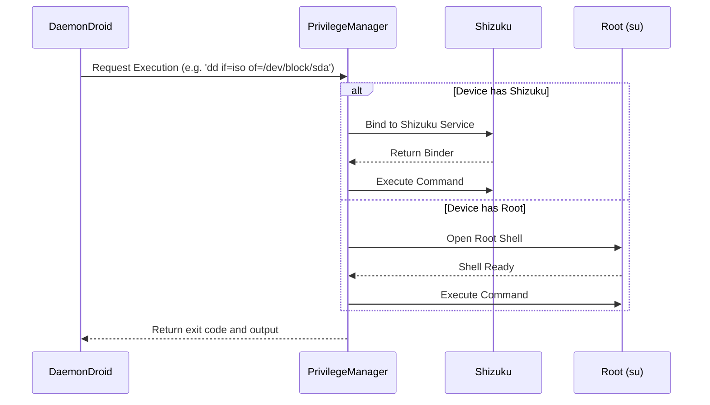

# DaemonDroid Architecture

This document provides a high-level overview of how DaemonDroid operates, specifically focusing on the Privilege Engine and the Flash Execution flow.

## 1. System Architecture

DaemonDroid is structured using a standard Unidirectional Data Flow (UDF) pattern on the UI side, with a heavily concurrent execution backend.

## 2. The Privilege Engine

To write raw block devices on Android, standard app permissions are insufficient. DaemonDroid abstracts this by utilizing an interface that can swap between two privilege escalation paths seamlessly:

1. **Shizuku**: Uses an ADB-level permission bridge. Ideal for non-rooted users.
2. **libsu**: Standard root shell access for rooted devices.

## 3. Flash Operations

DaemonDroid handles three distinct types of flashing operations:

### Standard Flash (Linux ISOs)
A straight `dd` operation that streams the ISO file directly to the block device.

### Windows WIM Splitting
Because standard bootable USB drives are often formatted as FAT32 (for UEFI compatibility), files larger than 4GB cannot be copied. Windows ISOs often contain an `install.wim` file that exceeds this limit.
1. The app extracts the ISO contents to a temporary directory or directly to the target partition.
2. It detects if `install.wim` is > 4GB.
3. If so, it invokes `wimsplit` (via bundled binaries) to chunk the file into `install.swm` files before writing them to the USB drive.

### Ventoy Integration
DaemonDroid brings Ventoy to Android by downloading the official Ventoy binaries on-demand.

## 5. UI Architecture & Optimization

The Jetpack Compose UI follows strict performance guidelines:
1. **Unidirectional Data Flow**: State is hoisted to Hilt-injected `ViewModels`.
2. **Immutability guarantees**: Complex data classes (e.g., `BlockDeviceInfo`, `FlashJob`, `LogEntry`) are explicitly decorated with `@Immutable` annotations, ensuring the Compose compiler skips unnecessary recomposition phases when rendering lists of drives or streaming terminal logs.
3. **Resource Abstraction**: Hardcoded text and constants are extracted into localized `strings.xml` resources, ensuring the UI remains adaptable.
